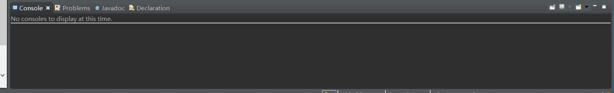

# Java中级测试题五(2/2)

1. 编写一服务器端程序，实现读取客户端发送过来的一组整数，表现为一组数与数之间用空格隔开的字符串。对这组整数进行排序处理后，返回相应的字符串给客户端，如果数据格式不正确，则返回错误信息，以本机作为服务器。

#### Server.java
```
import java.io.BufferedReader;
import java.io.InputStreamReader;
import java.io.OutputStreamWriter;
import java.io.PrintWriter;
import java.net.ServerSocket;
import java.net.Socket;
import java.util.Arrays;

public class Server {

	public static void charServer() {
		// 创建服务端套接字
		ServerSocket server = null;
		try {
			server = new ServerSocket(50000);
			//获取客户端的套接字实例
			Socket client=server.accept();
			System.out.println(client);
			
			try(
					BufferedReader br=new BufferedReader(new InputStreamReader(client.getInputStream()));
					PrintWriter pw=new PrintWriter(new OutputStreamWriter(client.getOutputStream()),true)
							)
			{
				String clientMessage=br.readLine();//接收客户端信息
				/**
				 * 首先得判定数据格式是否正确
				 * 
				 * 此处需要把这个String类型转换成int数组类型
				 */
				System.out.println("client:"+clientMessage);
				String[] strArray = clientMessage.split(",");//将String类型的数字转换成数组
				boolean bl = false;
				try {
					for(String i:strArray) {
						Integer.parseInt(i);
					}
				} catch (Exception e) {
					bl = true;
					e.printStackTrace();
				}
				if(!bl) {
					//此处需要将数组转成字符串
					Arrays.sort(strArray);
					String sortArrayMs = "";
					for(String i:strArray) {
						System.out.println(i);
						sortArrayMs += i;
					}
					pw.println(sortArrayMs);
				}
				/* pw.flush(); */
			}catch (Exception e) {
				e.printStackTrace();
			}
		} catch (Exception e) {
			e.printStackTrace();
		}
	}
	public static void main(String[] args) {
		charServer();
	}
}
```
#### Client.java
```
import java.io.BufferedReader;
import java.io.InputStreamReader;
import java.io.PrintWriter;
import java.net.Socket;
import java.net.SocketAddress;

public class Client {

	public static void charClient() {
		// 创建客户端套接字
		Socket client=null;
		try {
			client=new Socket("localhost", 50000);
			
			SocketAddress address=client.getRemoteSocketAddress();
			
			System.out.println(address.toString());
			
			//客户端先打招呼
			try(PrintWriter pw=new PrintWriter(client.getOutputStream(),true);
					BufferedReader br=new BufferedReader(new InputStreamReader(client.getInputStream())))
			{
				pw.println("8,3,2,1,9,7,5,4,6");//向服务端发送信息
				String serverMessage=br.readLine();//接收服务端信息
				System.out.println("this is server message");
				System.out.println("server:"+serverMessage);
			}catch (Exception e) {
				e.printStackTrace();
			}
		} catch (Exception e) {
			e.printStackTrace();
		}
	}
	public static void main(String[] args) {
		charClient();
	}
}
```
效果如下：


2、编写一个简单的socket通讯程序：

2.1 客户机程序，从控制台输入字符串，发送到服务器端，并将服务器返回的信息显示出来。

2.2 服务器端程序，从客户机接收数据并打印，同时将从标准输入获取的信息发送给客户机

2.3 满足一个服务器可以服务多个客户

实现效果如图：
图1：服务器端效


图2：客户器端效果：


```
package highchapter5;

import java.io.IOException;
import java.net.ServerSocket;
import java.net.Socket;
import java.util.ArrayList;
import java.util.List;

public class Server2 {
//	2、编写一个简单的socket通讯程序：
//	2.1 客户机程序，从控制台输入字符串，发送到服务器端，并将服务器返回的信息显示出来。
//	2.2 服务器端程序，从客户机接收数据并打印，同时将从标准输入获取的信息发送给客户机
//	2.3 满足一个服务器可以服务多个客户
	
	static List<Socket> list = new ArrayList<Socket>();
	
	public static void main(String[] args) {

		ServerSocket so;
		try {
			so = new ServerSocket(4001);
			System.out.println("服务器启动");
			while(true) {
				Socket s = so.accept();
				System.out.println(s.getInetAddress() + "发送请求");
				list.add(s);
				One o = new One();
				Thread t = new Thread(o);
				t.start();
			}
		} catch (IOException e) {
			e.printStackTrace();
		}
	}
}
```
```
package highchapter5;

import java.io.BufferedReader;
import java.io.IOException;
import java.io.InputStreamReader;
import java.net.Socket;

public class One implements Runnable {

	@Override
	public void run() {
		Socket s = Server2.list.get(Server2.list.size() - 1);
		String str = "";
		SendAll sendAll = new SendAll();
		Thread t1 = new Thread(sendAll);
		t1.start();
		try {
			while(true) {
				BufferedReader br = new BufferedReader
						(new InputStreamReader(s.getInputStream()));
				str = br.readLine();
				System.out.println("客户端" + s.getInetAddress() + "说: " +str);
			}
		} catch (IOException e) {
			System.out.println(s.getInetAddress() + "用户下线");
			Server2.list.remove(s);
		}
	}
}
```
```
package highchapter5;

import java.io.BufferedReader;
import java.io.InputStreamReader;
import java.io.OutputStreamWriter;
import java.io.PrintWriter;
import java.net.Socket;
import java.util.Scanner;

public class SendAll implements Runnable {

	Scanner in = new Scanner(System.in);
	BufferedReader br = new BufferedReader(new InputStreamReader(System.in));
	@Override
	public void run() {
		PrintWriter out = null;
		try {
			while(true) {
				String str = br.readLine();
				for(Socket s:Server2.list) {
					out = new PrintWriter
							(new OutputStreamWriter(s.getOutputStream()), true);
					out.println(str);
				}
			}
		} catch (Exception e) {
			e.printStackTrace();
		}finally {
			out.close();
		}
	}
}
```
```
package highchapter5;

import java.io.BufferedReader;
import java.io.IOException;
import java.io.InputStreamReader;
import java.net.Socket;
import java.net.UnknownHostException;

public class Client2 {
	public static void main(String[] args) {
		BufferedReader br = null;
		String clientStr = "";
		//建立通信端口，并向服务器端发送通信请求
		try {
			Socket s = new Socket("127.0.0.1",4001);
			System.out.println("与服务器端建立连接");
			Send send = new Send(s);
			Thread t1 = new Thread(send);
			t1.start();
			while(true) {
				//获取客户端通信的信息
				br = new BufferedReader(new InputStreamReader(s.getInputStream()));
				clientStr = br.readLine();
				System.out.println("服务器端说：" + clientStr);
			}
		} catch (UnknownHostException e) {
			e.printStackTrace();
		} catch (IOException e) {
			e.printStackTrace();
		}
	}
}
```
```
package highchapter5;

import java.io.BufferedReader;
import java.io.InputStreamReader;
import java.io.OutputStreamWriter;
import java.io.PrintWriter;
import java.net.Socket;
import java.util.Scanner;

public class Send implements Runnable {
	
	Socket s;
	Scanner in = new Scanner(System.in);
	BufferedReader br = new BufferedReader
			(new InputStreamReader(System.in));

	public Send(Socket s) {
		this.s = s;
	}

	@Override
	public void run() {
		PrintWriter out = null;
		try {
			while(true) {
				out = new PrintWriter
						(new OutputStreamWriter(s.getOutputStream()),true);
				String str = br.readLine();
				out.println(str);
			}
		} catch (Exception e) {
			e.printStackTrace();
		}finally {
			out.close();
		}
	}
}
```



#### 扩展知识：

[JAVA基本数据类型及其对应的包装类](https://blog.csdn.net/yangyechi/article/details/82530447)

[StarUML使用简明教程](https://blog.csdn.net/luansha0/article/details/82260678)

[如何使用staruml画用例图](https://jingyan.baidu.com/article/e8cdb32b5cdf9137052bad93.html)

==================================================================
#### 分割线
==================================================================

**博主为咯学编程：父母不同意学编程，现已断绝关系;恋人不同意学编程，现已分手;亲戚不同意学编程，现已断绝来往;老板不同意学编程,现已失业三十年。。。。。。如果此博文有帮到你欢迎打赏，金额不限。。。**

